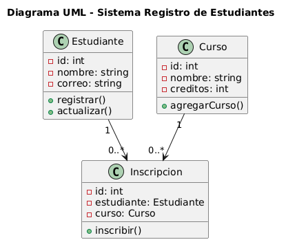
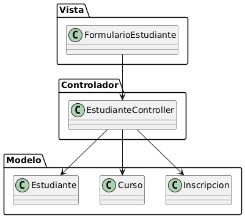

# Mini Proyecto MVC: Registro de Estudiantes, Cursos e Inscripciones

Este mini proyecto implementa el patrón de arquitectura MVC (Modelo-Vista-Controlador) para gestionar el registro de estudiantes, cursos y la inscripción de estudiantes en cursos. Permite agregar estudiantes y cursos, así como inscribir estudiantes en los cursos disponibles, mostrando la información en tiempo real en la interfaz.

## Tecnologías utilizadas

- **HTML5**: Estructura de la interfaz de usuario.
- **Bootstrap 5**: Estilos y componentes responsivos.
- **TypeScript**: Lógica del modelo y controladores, compilado a JavaScript.
- **JavaScript**: Ejecución en el navegador (archivo generado a partir de TypeScript).

## Descripción de roles de cada componente
- **Vista**: Representa la interfaz de usuario.
- **Controlador**: Recibe y procesa los datos del usuario, actualiza el modelo y muestra la información en tiempo real.
- **Modelo**: Representa los datos y la lógica de negocio. Ej: clases Estudiante, Curso, Inscripcion.

## DIAGRAMAS
- **Los Diagramas se realizaron el PlantUML**
### Diagrama UML
;
## pseudo código
```
@startuml MVC
title Diagrama de Arquitectura MVC - Registro de Estudiantes

actor Usuario

Usuario --> Vista : Interacción (Formulario)
Vista --> Controlador : Envía datos del formulario
Controlador --> Modelo : Procesa y actualiza datos
Modelo --> Controlador : Devuelve datos o estado
Controlador --> Vista : Muestra respuesta actualizada

@enduml

```

### Diagrama de arquitectura MVC
;

## pseudo código
```
@startuml UML_Clases
title Diagrama UML - Sistema Registro de Estudiantes

class Estudiante {
  - id: int
  - nombre: string
  - correo: string
  + registrar()
  + actualizar()
}

class Curso {
  - id: int
  - nombre: string
  - creditos: int
  + agregarCurso()
}

class Inscripcion {
  - id: int
  - estudiante: Estudiante
  - curso: Curso
  + inscribir()
}

Estudiante "1" --> "0..*" Inscripcion
Curso "1" --> "0..*" Inscripcion

@enduml

```

## Realizado por Dany Abimael Cabrera Hernández
## Carne: 2890-22-1898
## Universidad Mariano Galvez
## Semestre #8 ANÁLISIS DE SISTEMAS II
## Tarea #1 MVC